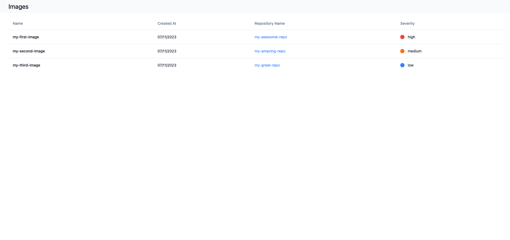

# Aqua Candidate Test

Welcome to Aqua’s challenge.

## Table of Contents

- [Aqua Candidate Test](#aqua-candidate-test)
  - [Table of Contents](#table-of-contents)
  - [Introduction](#introduction)
  - [Setup Instructions](#setup-instructions)
  - [Backend](#backend)
  - [Frontend](#frontend)
    - [General Instructions](#general-instructions)
      - [Images Page](#images-page)
      - [Repositories Page](#repositories-page)
    - [Page behavior](#page-behavior)


## Introduction

In this challenge, you will create a frontend application using React, TypeScript, and Vite. The application will interact with a provided backend server to display data on two pages: Images and Repositories.


## Setup Instructions

1. **Clone the repository**:
   
   You have been provided with an access to our repo
   ```terminal
   git clone https://github.com/your-repo.git
   cd your-repo
2. **Install Dependencies (node version 18+ is required)**:
   ```terminal
   npm i
3. **Run the app (server + client)**:
   ```terminal
   npm run start
4. **Use anything you like**:
   
   Feel free to install any library /module that you think can help you in your task

## Backend
The server provides the following endpoints:

- `GET /repositories`: Retrieves a list of repositories.
- `GET /images`: Retrieves a list of images.
 - `GET /connections`: Retrieves a list of connections between images and repositories.

To view the server data, refer to `db.json`.

## Frontend
your task is to build 2 screens using the data from the server: Images and Repositories.

### General Instructions

- You are provided with an empty react app skeleton created using [vite](https://vitejs.dev/guide/#scaffolding-your-first-vite-project).

- The frontend app is running on port: `5173`

- To call an api endpoint use `'/api'` prefix, for example: 
  `fetch('/api/images')`


#### Images Page
The Images page should contain:

- **Header**: Title 'Images'
- **Table** with 4 columns:

 - Name
 - Created At (formatted as `dd/mm/yyyy`)
 - Repository Name (links to Repositories page with ID)
 - Severity (colored indicator)

**Pointers**:

- Use the connections array to get the repository name/id.

- Severity should display with a color indicator (see screenshot below).




#### Repositories Page
The Repositories page should contain:

- **Header**: Title 'Repositories'
- **Table** with 4 columns:

 - Name
 - Created At (formatted as `dd/mm/yyyy`)
 - Image Name (links to Images page with ID)
 - Size (formatted to KB/MB/GB)

**Pointers:**

- Use the connections array to get the image name/id.

- Size should be formatted to KB/MB/GB, e.g., 1234567890 should be displayed as 1.14GB.


### Page behavior 
> The example given here is for images, but the same is true for repositories as well.

- If you visit the page without an ID (e.g., /images), display all entities.
- If you visit the page with an ID (e.g., /images/550e8400-e29b-41d4-a716-446655440000), filter and display only the entity with the matching ID.


We trust you'll impress us :)